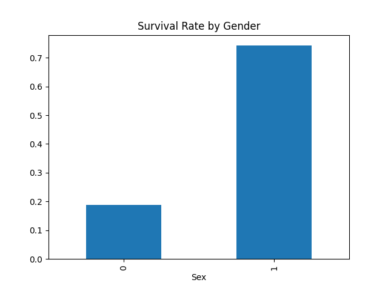
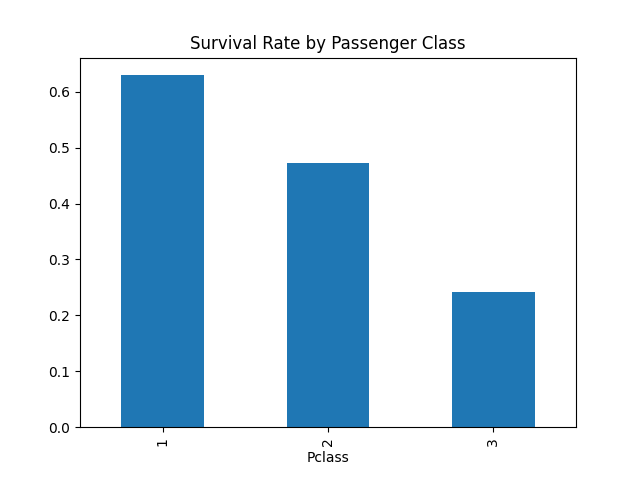

# Titanic Survival Prediction

## Project Overview

This project predicts whether a passenger survived the Titanic disaster using machine learning classification algorithms.

The goal was to build an end-to-end machine learning pipeline including data cleaning, exploratory data analysis, feature engineering, model training, and evaluation.

---

## Dataset

Source:
https://www.kaggle.com/competitions/titanic

Dataset contains information about passengers including:

- Age
- Gender
- Passenger Class
- Fare
- Family Size
- Embarkation Port

Target Variable:

- Survived (0 = No, 1 = Yes)

---

## Technologies Used

- Python
- Pandas
- NumPy
- Matplotlib
- Scikit-learn

---

## Data Preprocessing

### Missing Values

- Age filled using median value
- Embarked filled using mode
- Cabin dropped due to excessive missing values

### Feature Encoding

- Sex converted to numerical values
- Embarked encoded into numerical categories

---

## Exploratory Data Analysis
## Survival by Gender

## Survival by Passenger Class

### Survival Rate by Gender

| Gender | Survival Rate |
|----------|----------|
| Female | 74.2% |
| Male | 18.9% |

### Survival Rate by Passenger Class

| Class | Survival Rate |
|---------|---------|
| 1st | 62.9% |
| 2nd | 47.3% |
| 3rd | 24.2% |

---

## Models Used

### Logistic Regression

Accuracy: 79.89%

### Decision Tree

Accuracy: 74.30%

### Random Forest

Accuracy: 83.24%

---

## Model Comparison

| Model | Accuracy |
|---------|---------:|
| Logistic Regression | 79.89% |
| Decision Tree | 74.30% |
| Random Forest | 83.24% |

Best Model: Random Forest

---

## Key Learnings

- Data cleaning techniques
- Handling missing values
- Classification algorithms
- Confusion Matrix
- Precision, Recall and F1 Score
- Model comparison

---

## Future Improvements

- Hyperparameter tuning
- Cross-validation
- Feature engineering
- XGBoost

---

## Author

Akshat Das